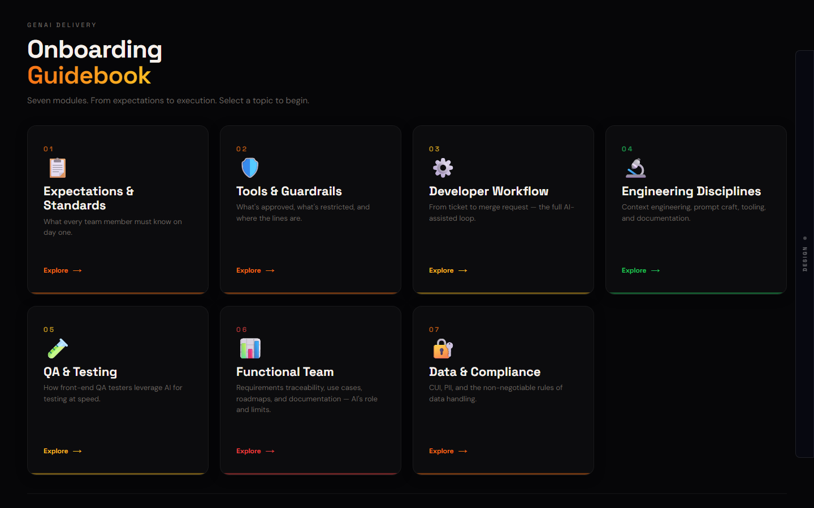

# Architecture Deck System

[](https://github.com/tafreeman/architecture-deck-system/actions/workflows/ci.yml)
[](LICENSE)
[](https://tafreeman.github.io/architecture-deck-system/)

React 19 + Vite 6 presentation platform with 6 registered content decks, 39 registered layouts, 16 themes, and 4 style modes. Includes Storybook for visual testing and an export pipeline for HTML, images, and PDF.

## Landing Page

**[tafreeman.github.io/architecture-deck-system](https://tafreeman.github.io/architecture-deck-system/)** — static landing page (ember/console design system), deployed from [`docs/`](docs/) via GitHub Actions ([`.github/workflows/deploy-pages.yml`](.github/workflows/deploy-pages.yml)). The workflow also builds the React deck viewer and publishes it at [`/demo/`](https://tafreeman.github.io/architecture-deck-system/demo/).

## Preview (local deck viewer)



*Onboarding Guidebook deck — midnight-teal theme, info-cards layout. Open the DESIGN panel to switch decks, themes, and style modes at runtime.*

## Quick Start

```bash
npm install

npm run dev          # Dev server on :5173
npm run build        # Production build (TypeScript check + Vite)
npm run storybook    # Storybook on :6006 (autodocs enabled)
npm run export:all   # Export HTML + images + PDF
```

## Architecture

### Layer Overview

| Layer | File(s) | Responsibility |
|-------|---------|----------------|
| **Shell** | `src/App.v14.tsx` | Deck factory, state, context providers, ControlPanel |
| **Layout Registry** | `src/layouts/registry.ts` | O(1) Map-based plugin system; 39 IDs across 8 families |
| **Layout Renderer** | `src/layouts/LayoutRenderer.tsx` | Resolves layout string → component; handles `stat-cards-manifest` routing |
| **Transcription** | `src/transcription.ts` | Cross-family content normalisation (e.g. `adv-future` → `h-strip`) |
| **Content Registry** | `src/content/content-registry.ts` | Runtime content-pack swapping; `CONTENT_PACKS` + `DECK_STRUCTURES` maps |
| **Merge Utility** | `src/content/merge-deck-content.ts` | 5-step cascading match — merges structure skeleton with text content |
| **Tokens** | `src/tokens/themes.ts`, `style-modes.ts`, `palette.ts` | 16 themes × 4 style modes orthogonal matrix; per-slide color resolution |
| **Contexts** | `src/components/context/` | `ThemeContext`, `ChromeContext` consumed by all layout components |

### Data Flow

```
deck.js (legacy) OR structure.js + content.json
  → mergeDeckContent()          5-step cascade match
  → MergedDeck                  { slides, deckMeta, matchStats }
  → resolveTopicColors()        assigns color/colorLight/colorGlow per slide
  → transcribeTopic()           normalises content for target layout family
  → LayoutRenderer              resolves layout string → registered component
  → Layout Component            renders with Theme + StyleMode + viewport tokens
```

The legacy `deck.js` path is retained for strangler migration compatibility and local presets such as `onboarding-op`. Runtime content-pack swapping uses the migrated `structure.js` + `content.json` path registered in `src/content/content-registry.ts`.

### Layout Registry Pattern

Layouts self-register at startup via side-effect imports. `register-all.ts` is imported once in `App.v14.tsx` and cascades to all 8 family registration files. Each `register.ts` calls `layoutRegistry.register(id, Component, features)`.

`LayoutRenderer` adds one routing rule: `stat-cards` slides with `results`, `leadershipPoints`, `enablement`, or `thesis` fields are routed to the `stat-cards-manifest` variant.

## Layout Families

| Family | IDs | Registered Layout IDs |
|--------|-----|-----------------------|
| base | 6 | `two-col`, `stat-cards`, `stat-cards-manifest`, `before-after`, `h-strip`, `process-lanes` |
| verge-pop | 6 | `stat-hero`, `quote-collage`, `badge-grid`, `data-table`, `bar-chart`, `color-blocks` |
| sprint | 1 | `process-cycle` |
| onboarding | 7 | `info-cards`, `checklist`, `workflow`, `pillars`, `catalog`, `op-brief`, `op-flow` |
| handbook | 5 | `hb-chapter`, `hb-practices`, `hb-process`, `hb-manifesto`, `hb-index` |
| engineering | 4 | `eng-architecture`, `eng-code-flow`, `eng-tech-stack`, `eng-roadmap` |
| advocacy | 5 | `adv-overview`, `adv-stats`, `adv-hurdles`, `adv-future`, `adv-platform` |
| advocacy-dense | 5 | `advd-overview`, `advd-stats`, `advd-hurdles`, `advd-future`, `advd-platform` |
| **Total** | **39** | |

## Content Decks

| Deck Key | Label | Theme |
|----------|-------|-------|
| `current` | Current (Advocacy) | midnight-teal |
| `genai` | GenAI Case Study | (see structure.js) |
| `engineering` | Engineering | (see structure.js) |
| `onboarding` | Onboarding | (see structure.js) |
| `verge-pop` | Verge Pop | verge-orange |
| `studio` | Studio Handbook | studio-craft |

Each deck consists of `structure.js` (layout skeleton with colors) + `content.json` (text data). Runtime content swapping is supported — any content pack can be applied to any structure via the ControlPanel "DECK" picker.

## Themes and Style Modes

16 themes × 4 style modes form an orthogonal matrix — any combination is valid.

**Themes:** midnight-teal (default), obsidian-ember, arctic-steel, midnight-verdant, neon-noir, paper-ink, atelier-sage, signal-cobalt, verge-orange, verge-blue, verge-pink, verge-yellow, gamma-dark, studio-craft, linear, console

**Style Modes:** default (Modern Tech), brutalist (Swiss Systems), editorial (Magazine Pacing), pop (Bold Flat Zine)

Per-slide accent colors are derived from each theme's semantic palette (`accent`, `gradient[0/1]`, `success`, `warning`, `danger`) and rotated across slides by index.

## Storybook

Autodocs enabled. Global `ThemeContext` + `ChromeContext` decorator with theme/chrome toolbar selectors in `.storybook/preview.jsx`.

## Developer Guides

See `docs/DOCUMENTATION-REVIEW.md` for:
- How to add a new layout family
- How to add a new theme
- How to add a new content deck
- Key interface quick reference
- Known issues and technical debt

## Gotchas

- Rollup does NOT auto-resolve `.js` → `.ts` — update import paths when renaming
- Tokens are `.ts` with exported interfaces — import with `.ts` extension
- All components are `.tsx`, stories remain `.jsx`
- Unit tests run on Vitest (`npm test`); Storybook (`npm run storybook`) is for visual/interaction review
- `@storybook/addon-actions` not installed — use `console.log` shim instead
- `stat-cards-manifest` is a registered layout ID (auto-routed by LayoutRenderer when slide has manifest fields) — do not register a new layout with this ID
- Layout components receive `topic` prop (not `slide`) — this is the LayoutRenderer's forwarding alias

## Built with AI assistance

This presentation platform was built with AI-assisted development (LLM coding assistants) under human review. All sample deck content uses generic, illustrative examples — no client, employer, or engagement-identifying material.

## License

MIT — see [LICENSE](LICENSE).
